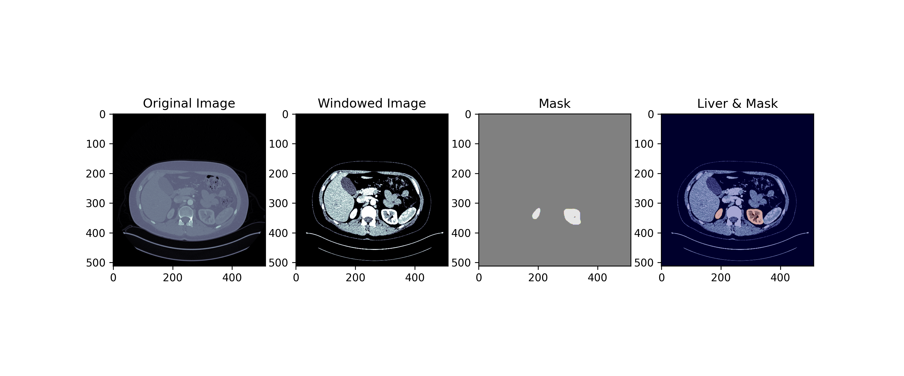
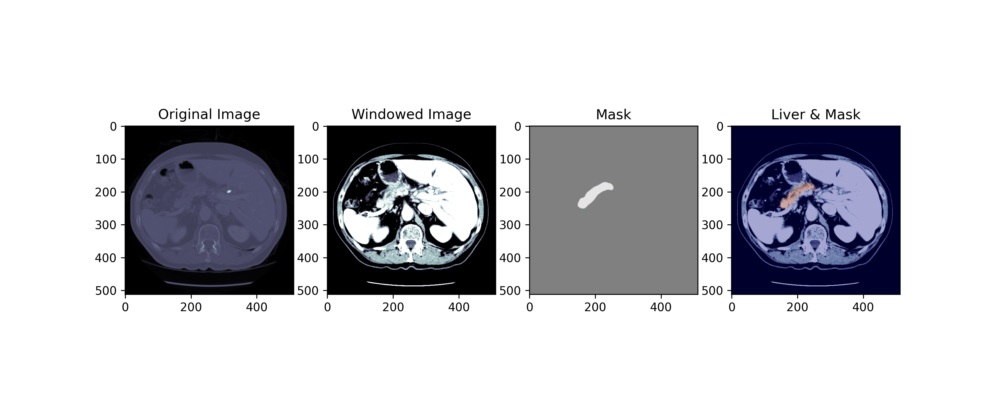
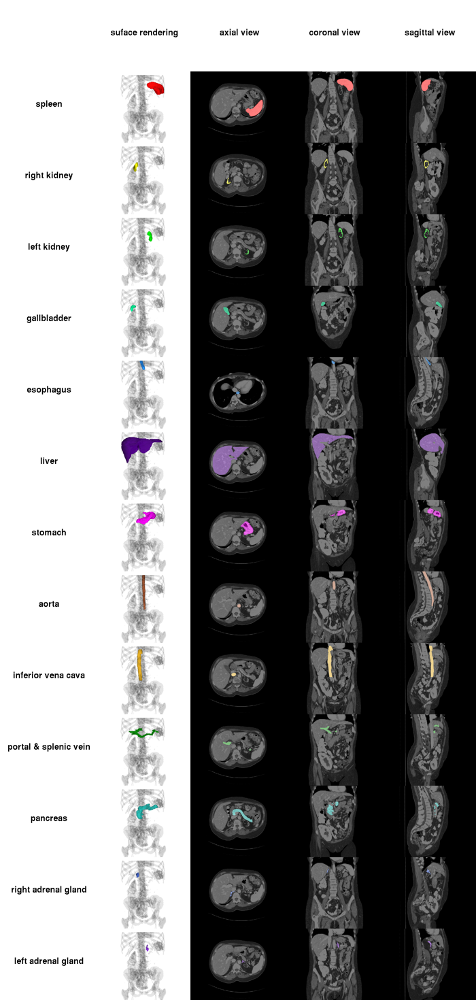

# CMT: A Confident Mean Teacher for Multi-organ Segmentation on Few-organ Datasets
For Peer Review Only.

[[Paper]](https://arxiv.org/abs/xxxx) 

### Update

**2021-05-11**: CMT pytorch code released

### Contents
0. [Introduction](#introduction)
0. [Citation and license](#citation)
0. [Requirements](#requirements)
0. [Datasets](#datasets)
0. [Usage](#usage)
0. [Results](#results)
0. [Note](#note)

### Introduction

This repository provides the detailed code for the NeurIPS2021 submitted paper ["CMT: A Confident Mean Teacher for Multi-organ Segmentation on Few-organ Datasets "](https://arxiv.org/abs/xxxx). The code contains the core module, `lib.models.MultiOrganNet`,  a 3D-CNN for the implementation of the `student` model and `teacher` model,  which implements the proposed `Mixture Multi-Hypotheses Network` in the main text that simultaneously obtains an initial segmentation and its uncertainty estimates. 


Fig. 1. Structure of CMT.


Fig. 2. Illustration of segmentation with uncertainty estimation.
-----

### Citation and license
If you use this code or find our research helpful, please cite:

The model and code are available for non-commercial (NC) research purposes only. Please do not distribute this code during the review process. If you modify the code and want to redistribute, please include the CC-BY-NC-SA-4.0 license.

-----


### Requirements:
The code is implemented based on [Pytorch 1.7.1](https://pytorch.org/get-started/locally/) with CUDA 11.1, OpenCV xxx and Python 3.8.5. It is tested in Ubuntu 18.04.5 with two 11GB GeForce RTX 2080Ti GPUs. GPU usage is about 11GB.

Some important required packages include:
* [SimpleITK][simpleITK_link], a layer built on top of the Insight Toolkit (ITK), intended to simplify and facilitate ITK's use in rapid prototyping, education and interpreted languages.
* [NiBabel][niBabel_link] https://nipy.org/nibabel/], access a cacophony of neuro-imaging file formats
* [Pytorch][torch_link] version >=1.0.1.
* [PyMIC][pymic_link], a pytorch-based toolkit for medical image computing. Version 0.2 is required. 
* [TensorboardX][tensorboard_link] to visualize training performance
Some common python packages such as Numpy, Pandas, etc.

Follow official guidance to install [Pytorch][torch_link]. Install the other required packages by:

```sh
pip install -r requirements.txt
```
[simpleITK_link]:https://github.com/SimpleITK/SimpleITK
[niBabel_link]:https://nipy.org/nibabel/
[torch_link]:https://pytorch.org/
[pymic_link]:https://github.com/HiLab-git/PyMIC
[tensorboard_link]:https://www.tensorflow.org/tensorboard/graphs
----


### Datasets
Below are datasets used in this paper. Download the images and save them in to a single folder, like `project/data/LiTS`. 

>  **LiTS  (Liver and tumour)**
>>* Modality: Portal venous phase CT
>>* Size: 201 3D volumes (131 Training + 70 Testing)
>>* Source: IRCAD Hôpitaux Universitaires
>>* Challenge: Label unbalance with a large (liver) and small (tumour) targe
>>*  You can download this dataset from [here](http://medicaldecathlon.com/index.html)

>> The  downloaded `data/` directory  should then be structured as follows
```
├── dataset.json
├── imagesTr
│   ├── liver_0.nii
│   ├── liver_100.nii
│   ├── liver_101.nii
...
├── imagesTs
│   ├── liver_132.nii.gz
│   ├── liver_133.nii.gz
│   ├── liver_134.nii.gz
...
└── labelsTr
    ├── liver_0.nii
    ├── liver_100.nii
    ├── liver_101.nii
```

>  **KiTS  (Kidney and tumour)**
>> To get the data for official [2019 KiTS Challenge](https://kits19.grand-challenge.org), please clone [this repository](https://github.com/neheller/kits19)(~500MB) , and then run `starter_code/get_imaging.py`. 
>> The  downloaded `data/` directory  should then be structured as follows

```
data
├── case_00000
|   ├── imaging.nii.gz
|   └── segmentation.nii.gz
├── case_00001
|   ├── imaging.nii.gz
|   └── segmentation.nii.gz
...
├── case_00209
|   ├── imaging.nii.gz
|   └── segmentation.nii.gz
└── kits.json
```


> **Pancreas Tumour** 
>>* Modality: Portal venous phase CT
>>* Size: 420 3D volumes (281 Training +139 Testing)
>>* Source: Memorial Sloan Kettering Cancer Center
>>* Challenge: Label unbalance with large (background), medium (pancreas) and small (tumour) structures. 
>>*  You can download this dataset from [here](http://medicaldecathlon.com/index.html)
>> The  downloaded `data/` directory  should then be structured as follows
```
├── dataset.json
├── imagesTr
│   ├── pancreas_001.nii.gz
│   ├── pancreas_004.nii.gz
│   ├── pancreas_005.nii.gz
...
├── imagesTs
│   ├── pancreas_002.nii.gz
│   ├── pancreas_003.nii.gz
│   ├── pancreas_007.nii.gz
...
└── labelsTr
    ├── pancreas_001.nii.gz
    ├── pancreas_004.nii.gz
    ├── pancreas_005.nii.gz
```



> **BCV**

>>* [Multi-Atlas Labeling Beyond the Cranial Vault](https://www.synapse.org/#!Synapse:syn3193805/wiki/89480)
>>*  You can download this dataset from [here](https://www.synapse.org/#!Synapse:syn3193805/files/).  The dataset is under the "Abdomen" folder in the "Files" tab.
>>* Abdomen CT Scans :Under Institutional Review Board (IRB) supervision, 50 abdomen CT scans of were randomly selected from a combination of an ongoing colorectal cancer chemotherapy trial, and a retrospective ventral hernia study. The 50 scans were captured during portal venous contrast phase with variable volume sizes (512 x 512 x 85 - 512 x 512 x 198) and field of views (approx. 280 x 280 x 280 mm3 - 500 x 500 x 650 mm3). The in-plane resolution varies from 0.54 x 0.54 mm2 to 0.98 x 0.98 mm2, while the slice thickness ranges from 2.5 mm to 5.0 mm. The standard registration data was generated by NiftyReg.
>>* Organs to Segment

Category|1|2|3|4|5|6|7|8|9|10|11|12|13
---|---|---|---|---|---|---|---|---|---|---|---|---|---
Organs | spleen | right kidney | left kidney|  gallbladder|  esophagus | liver| stomach| aorta| inferior vena cava | portal vein and splenic vein (veins) | pancreas | right adrenal gland | left adrenal gland

In the label images, these organs are labeled as their associate numbers listed above. Some patients may not have (2) right kidney or (4) gallbladder, and thus are not labeled. Below is a brief overview of the 13 organs.


Raw data are separated into 30 training and 20 testing subjects.
`BTCV/MTCRawData/Training/`
`BTCV/RawData/Testing/`  
To access an image file, e.g., `/RawData/Training/img/img0001.nii.gz`. To access an label file, e.g., `/RawData/Training/label/label0001.nii.gz

------


## Usage
We assume you are working in CMT-master folder.

0. To run the self-training, you need to set the data paths of source data (data-src-dir) and target data (data-tgt-dir) by yourself. Besides that, you can keep other argument setting as default.

1. Play with self-training for GTA2Cityscapes.
- CBST:
~~~~
sh cbst.sh
~~~~
- CRST-MRKLD:
~~~~
sh mrkld.sh
~~~~
- CRST-LREND:
~~~~
sh lrent.sh
~~~~
2. 
- For CBST, set "--kc-policy cb --kc-value conf". You can keep them as default.
- Multi-scale testing are implemented in both self-training code and evaluation code. Set MST with "--test-scale".
- We use a small class patch mining strategy to mine the patches including small classes. To turn off small class mining, set "--mine-chance 0.0".
3. Evaluation
- Test in Cityscapes for model compatible with GTA-5 (Initial source trained model as example). Remember to set the data folder (--data-dir).
~~~~
sh evaluate.sh
~~~~

4. Train in source domain. Also remember to set the data folder (--data-dir).
- Train in GTA-5
~~~~
sh train.sh
~~~~
- Train in Cityscapes, please check the [original DeepLab-ResNet-Pytorch repository](https://github.com/speedinghzl/Pytorch-Deeplab).

1. Run the following commands to use UAMTNet for training.
```python
python main.py
```
1. Run the following commands to use UAMTNet for testing.
```python
python test.py
```
----


### Note
- This code is based on [DeepLab-ResNet-Pytorch](https://github.com/speedinghzl/Pytorch-Deeplab).
- The code is tested in Pytorch 0.4.0 and Python 2.7. We found running the code with other Pytorch versions will give different results. I suggest to run the code with the exact Pytorch version 0.4.0. Different performances on even 0.4.1 were reported by other users of this code.
